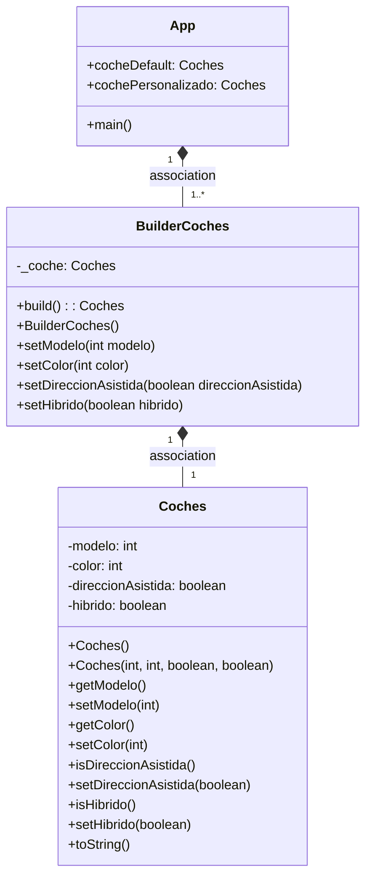
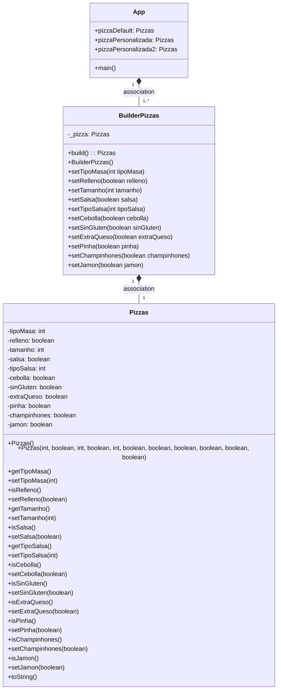

# Patrón Builder  

---    

## REFLEXIONA:
1. ¿Cual es la función del patrón builder? Pon ejemplo (que no sea Pizzas)

   Este patrón nos permite crear un objeto por partes, le vamos proporcionando las distintas partes al Builder
   y cuando ya lo tiene todo, le pedimos que nos entregue el objeto construido. Además, podemos utilizar el mismo Builder
   para crear varias instancias del mismo tipo pero con distintos atributos.

Otro ejemplo podría ser con las clases Coches, BuilderCoches y la main.
- Clase Coches: declaramos los atributos y las constantes literales. Escribimos el constructor para el coche por defecto,
el que nos devolverá un coche por defecto con los atributos que le indiquemos.

```
 public Coches() {
        this.modelo = SEDAN;
        this.hibrido = true;
    }
```

También ponemos el constructor parametrizado con todos sus parámetros.

```
 public Coches(int modelo, int color,boolean direccionAsistida, boolean hibrido) {
        this.modelo = modelo;
        this.color = color;
        this.direccionAsistida = direccionAsistida;
        this.hibrido = hibrido;
    }
```

Y finalmente los getters y setters de cada atributo y el toString().

- Clase BuilderCoches: en ella, declaro un objeto de tipo coche, que será el que me devuelva el método build.

```
 private Coches _coche;

 public Coches build() {
            return this._coche;
        }
```

Creamos un métodos que me construya el coche para configurarlo.

```
 public BuilderCoches() {
            _coche = new Coches();
        }
```

Después ponemos los métodos set que nos van a devolver el BuilderPizzas, y finalmente el toString().

- Main: Realizamos los coches que queramos, tanto por defecto como personalizado con características que queramos nosotros.
Se instancia el Builder, lo caracterizo y cargo el objeto (build();). Por lo tanto, después de los setters que hagamos, le pedimos
que haga build y nos retorna el coche. Por ejemplo sería:
```
Coches cochePersonalizado = new BuilderCoches()
                .setColor(Coches.ROJO)
                .setDireccionAsistida(true)
                .setHibrido(false)
                .build();
        System.out.println(cochePersonalizado2.toString());
```


2. ¿Como es su Diagrama de clases de este ejemplo que has hecho? Realiza en el readme el diagrama

## Diagrama de clases (COCHES)




## Diagrama de clases (PIZZAS)




3. ¿Podríamos combinarlo con el patrón Factory? Explícalo con algo de código como lo harías

   Este patrón se podría utilizar en colaboración con el patrón de diseño Factory, de esta forma la factoría podría devolver un Builder de
   nuestra clase concreta y utilizaríamos el Builder para construir tantos objetos como queramos y con los atributos que necesitemos.

Existen algunas diferencias entre el patrón Builder y el Factory:
- Aunque ambos son patrones creacionales, las implementaciones son diferentes.

- El patrón Factory crea la instancia en un único paso con la invocación de un método de la factoría que lo devuelve inmediatamente,
  mientras que el patrón Builder suele requerir la invocación de varios métodos y un método final build que realiza la creación de la instancia.

- Los Builder son objetos con estado y requieren crear una instancia de Builder. En cambio, el patrón Factory no requiere crear una instancia
  y se puede compartir entre varios objetos que la necesitan.

- Por último, el patrón Builder proporciona más control sobre los pasos de la creación de la instancia y proporciona más flexibilidad para variar
  la representación interna de la instancia creada. Además, el Builder crea instancias con diferente composición de objetos.


**Ejemplo combinar patrón Builder y patrón Factory:**

Podríamos hacer una aplicación que nos construya diferentes tipos de coche. Cada tipo de coche tiene unas determinadas
características, por ejemplo el tipo de motor. Creamos la clase BuilderCoches y con ella construimos diferentes tipos de coches personalizados (con métodos 
por ejemplo conMotorCombustion, conMotorElectrico). 
Después creamos una clase FactoryCoches que utilice el BuilderCoches para crear distintos tipos de coches según sea necesario.
Por ejemplo la clase FactoryCoches puede tener el método crearHibrido, y ese método utilizará el BuilderCoches para construir ese coche con las
características que queramos.
Sería algo similar a esto:

```
public class Coches{
 private int motorCombustion;
 private int motorElectrico;
 
 //Sus correspondientes setters,getters y toString 
 }
 
 //Creamos la interfaz public interface IBuilderCoches {...}
 
 //Implementamos esa interfaz para cada tipo de coche que queremos construir
 
 public class CocheHibrido implements IBuilderCoches{
 //dentro de cada clase de tipo de coche ponemos métodos que con los setters anteriormente declarados, nos caracterice el coche.
  }
  
 //Después creamos la clase FactoryCoche que usa el BuilderCoches para construir los distintos tipos de coches
 
 public class FactoryCoche{
 
    //dentro ponemos los métodos para construir cada uno
    
    public Coches crearHibrido(){
     BuilderCoches miBuilder = new HibridoBuilder();
      
      //y nos construye el coche con las caracteristicas, por ejemplo:
        miBuilder.construirMotor();
        //nos formará el motor que le hayamos dicho antes, eléctrico o por combustión.
    }
   }
 
  
```


