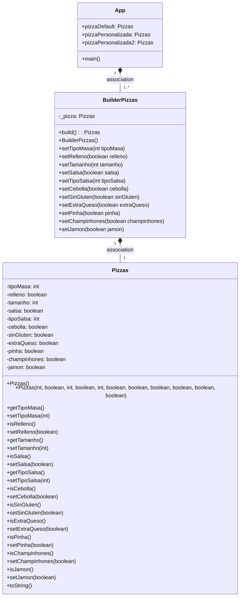

# Patrón Builder   
---

## REFLEXIONA:
1. ¿Cual es la función de este patrón?

   Este patrón nos permite crear un objeto por partes, le vamos proporcionando las distintas partes al Builder
   y cuando ya lo tiene todo, le pedimos que nos entregue el objeto construido. Además, podemos utilizar el mismo Builder
   para crear varias instancias del mismo tipo pero con distintos atributos.

2. ¿Como es su Diagrama de clases? Realiza en el readme el diagrama

## Diagrama de clases

3. ¿Podríamos combinarlo con el patrón Factory?

   Este patrón se podría utilizar en colaboración con el patrón de diseño Factory, de esta forma la factoría podría devolver un Builder de
   nuestra clase concreta y utilizaríamos el Builder para construir tantos objetos como queramos y con los atributos que necesitemos.

Existen algunas diferencias entre el patrón Builder y el Factory:
- Aunque ambos son patrones creacionales, las implementaciones son diferentes.

- El patrón Factory crea la instancia en un único paso con la invocación de un método de la factoría que lo devuelve inmediatamente,
  mientras que el patrón Builder suele requerir la invocación de varios métodos y un método final build que realiza la creación de la instancia.

- Los Builder son objetos con estado y requieren crear una instancia de Builder. En cambio, el patrón Factory no requiere crear una instancia
  y se puede compartir entre varios objetos que la necesitan.

- Por último, el patrón Builder proporciona más control sobre los pasos de la creación de la instancia y proporciona más flexibilidad para variar
  la representación interna de la instancia creada. Además, el Builder crea instancias con diferente composición de objetos.
